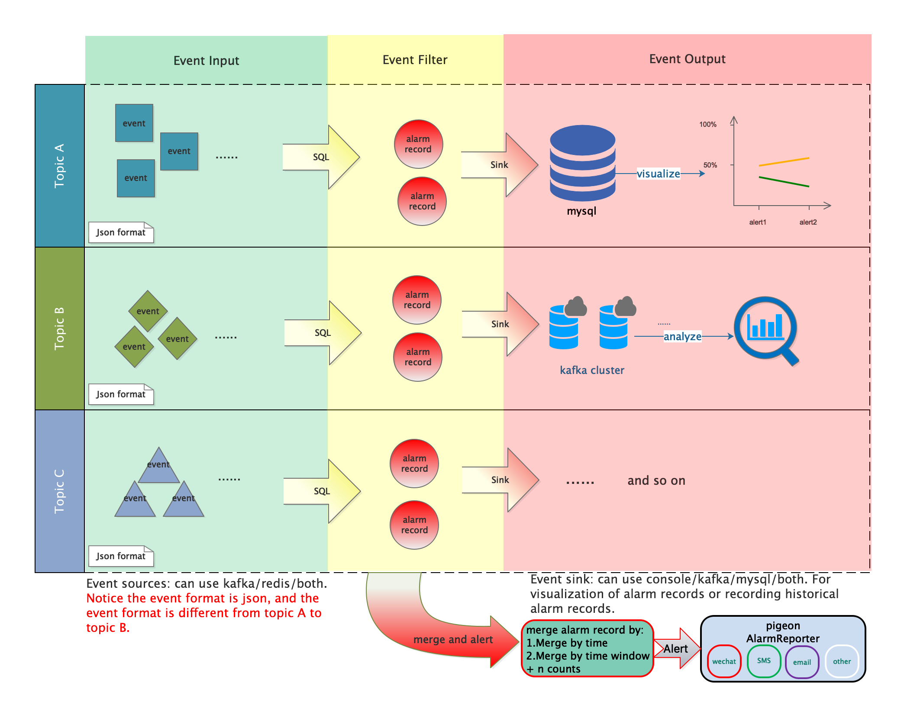
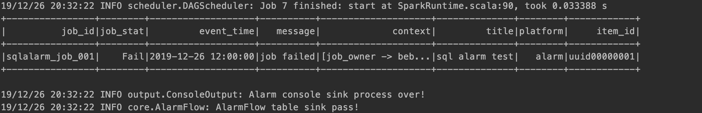

## SQLAlarm
> Big data smart alarm by sql

SQLAlarm is for event alarm which is built on spark structured-steaming. This system including following abilities:
1. Event filtering through SQL
2. Alarm record noise reduction
3. Alarm record dispatch in specified channels

The integral framework idea is as follows:


Introduce of modules:
1. sa-admin: web console and rest api for sqlalarm
2. sa-core: core module of sqlalarm

### Developing SQLAlarm
You can use bin/start-local.sh to start a local SQLAlarm serve. We recommend to run it use yarn-client or local mode in spark cluster after packaging jar.

Minimal requirements for a SQLAlarm serve are:
- java 1.8 + 
- Spark 2.4.x
- Redis (Redis 5.0, if use Redis Stream)
- Kafka (this is also needless if you only use Redis Stream for event alerts)

For example, I started a SQLAlarm serve that consume kafka event message to do alarm flow:
```bash
spark-submit --class dt.sql.alarm.SQLAlarmBoot \
        --driver-memory 2g \
        --master local[4] \
        --name SQLALARM \
        --conf "spark.kryoserializer.buffer=256k" \
        --conf "spark.kryoserializer.buffer.max=1024m" \
        --conf "spark.serializer=org.apache.spark.serializer.KryoSerializer" \
        sa-core-1.0-SNAPSHOT.jar \
        -sqlalarm.name sqlalarm \
        -redis.addresses "127.0.0.1:6379" \
        -redis.database 4 \
        -sqlalarm.sources kafka \
        -sqlalarm.input.kafka.topic  sqlalarm_event \
        -sqlalarm.input.kafka.subscribe.topic.pattern 1 \
        -sqlalarm.input.kafka.bootstrap.servers "127.0.0.1:9092" \
        -sqlalarm.sinks console
```
> notes: the above simple example takes kafka as the message center, filtering alarm event and output to the console.

### Quick Start
1. Packaged the jar: sa-core-1.0-SNAPSHOT.jar.
2. Deploy the jar package in spark cluster.
3. Add an alarm rule(put at redis): 
```bash
HSET "sql.alarm.rule:kafka: sqlalarm_event" "uuid00000001" 
{
    "item_id":"uuid00000001",
    "platform":"alarm",
    "title":"sql alarm test",
    "source":{
        "type":"kafka",
        "topic":" sqlalarm_event"
    },
    "filter":{
        "table":"fail_job",
        "structure":[
            {
                "name":"job_name",
                "type":"string",
                "xpath":"$.job_name"
            },
            {
                "name":"job_owner",
                "type":"string",
                "xpath":"$.job_owner"
            },
            {
                "name":"job_stat",
                "type":"string",
                "xpath":"$.job_stat"
            },
            {
                "name":"job_time",
                "type":"string",
                "xpath":"$.job_time"
            }
        ],
        "sql":"select job_name as job_id,job_stat,job_time as event_time,'job failed' as message, map('job_owner',job_owner) as context from fail_job where job_stat='Fail'"
    }
}
```
4. Wait for event center(may be kafka or redis) produce alarm event. Produce manually:
> 1.create topic: 
```bash
kafka-topics.sh --create --bootstrap-server localhost:9092 --replication-factor 1 --partitions 1 --topic  sqlalarm_event
```
> 2.produce event: 
```bash
kafka-console-producer.sh --broker-list localhost:9092 --topic  sqlalarm_event

{
    "job_name":"sqlalarm_job_001",
    "job_owner":"bebee4java",
    "job_stat":"Fail",
    "job_time":"2019-12-26 12:00:00"
}
```
5. If use console sink, you will get following info in the console:


